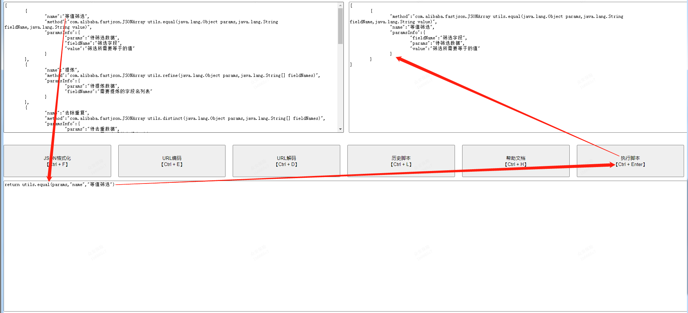

# 数据处理工具

## 地址

[es-tools]: http://123.206.207.177/	"没有域名，懒得备案"

## 功能介绍

### 直接功能


- JSON格式化


- URL编码
- URL解码
- 查看历史执行脚本


- 查看帮助文档


### API

| method                                                       | name           | paramsInfo                                                   |
| ------------------------------------------------------------ | -------------- | ------------------------------------------------------------ |
| com.alibaba.fastjson.JSONArray utils.equal(java.lang.Object params,java.lang.String fieldName,java.lang.String value) | 等值筛选       | {"fieldName":"筛选字段","params":"待筛选数据","value":"筛选所需要等于的值"} |
| com.alibaba.fastjson.JSONArray utils.refine(java.lang.Object params,java.lang.String[] fieldNames) | 提炼           | {"fieldNames":"需要提炼的字段名列表","params":"待提炼数据"}  |
| com.alibaba.fastjson.JSONArray utils.distinct(java.lang.Object params,java.lang.String[] fieldNames) | 去除重复       | {"fieldNames":"需要去重的字段名列表","params":"待去重数据"}  |
| java.lang.String utils.toMD(java.lang.Object params)         | 转化成MarkDown | {"params":"待转数据"}                                        |
| com.alibaba.fastjson.JSONObject utils.group(java.lang.Object params,java.lang.String fieldName,java.lang.String[] showFieldNames) | 分组           | {"fieldName":"分组字段","showFieldNames":"分组后需要显示字段名列表","params":"待分组对象"} |
| java.lang.Integer utils.count(java.lang.Object params)       | 统计数据量     | {"params":"待统计数据"}                                      |
| com.alibaba.fastjson.JSONArray utils.contains(java.lang.Object params,java.lang.String fieldName,java.lang.String value) | 包含值筛选     | {"fieldName":"筛选字段","params":"待筛选数据","value":"筛选所需要包含的值"} |
| java.math.BigDecimal utils.sum(java.lang.Object params,java.lang.String[] fieldNames) | 求和           | {"fieldNames":"需要求和的字段名列表","params":"待求和数据"}  |
| com.alibaba.fastjson.JSONArray utils.sort(java.lang.Object params,java.lang.String fieldName,boolean reverse) | 排序           | {"fieldName":"排序字段","params":"待排序对象","reverse":"是否倒序[true:倒序;false:正序]"} |

- 等值筛选



- 数据精炼


- 去重


- 转化成MD(如上表格就是如此生成)


### 在线编码


- 参数

```json
[
	{
		"name":"张三",
		"age":12
	},
	{
		"name":"李四",
		"age":22
	},
	{
		"name":"王五",
		"age":32
	},
	{
		"name":"赵六",
		"age":42
	},
	{
		"name":"张三",
		"age":52
	},
	{
		"name":"张三",
		"age":52
	}
]
```

- 代码

```java
//求平均年龄
int size = params.size();
int total = 0;
for(int idx=0;idx<size;idx++){
total = total + params.get(idx).get("age")
}
return total / size;
```

